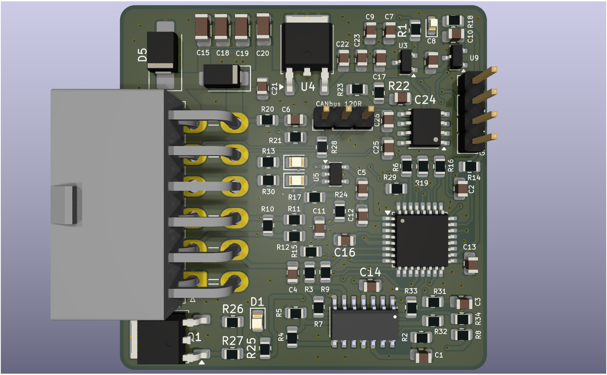
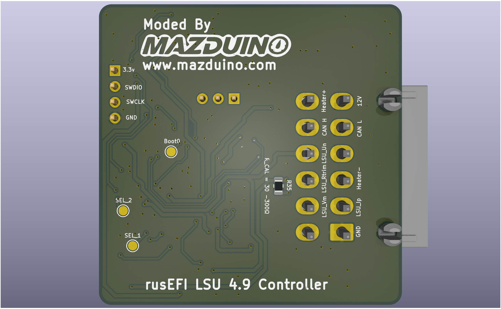

# Mazduino WBO (Wideband Oxygen Sensor Controller)

## PCB Views

| Top View (Component Side) | Bottom View |
|:-------------------------:|:----------:|
|  |  |

The **Mazduino WBO** is a Fork of the original Wideband Oxygen sensor controller designed to work with the rusEFI ecosystem. This project is specifically redesigned with components that are easier to manually assemble and uses economical Molex connectors to reduce cost while maintaining functionality.

## Overview

The Mazduino WBO provides accurate air-fuel ratio (AFR) monitoring for engine tuning and performance optimization. This module communicates with your ECU via **CAN bus**, enabling real-time AFR data transmission for precise fuel management. It's designed to be a cost-effective solution for DIY engine management enthusiasts who want reliable wideband oxygen sensor control.

## Key Features

- **CAN Bus Communication**: Communicates with ECU via CAN bus for real-time AFR data transmission
- **Multiple LSU Sensor Support**: Compatible with LSU 4.2, LSU 4.9, and LSU 4.9 Adv sensors
- **Easy Manual Assembly**: Redesigned with components that are straightforward to solder and assemble by hand
- **Economical Connectors**: Uses cost-effective Molex connectors instead of expensive alternatives
- **rusEFI Compatible**: Fully compatible with the rusEFI ecosystem for seamless integration
- **Open Source**: Complete schematics, PCB design files, and firmware available
- **Proven Design**: Based on the reliable [mck1117/wideband](https://github.com/mck1117/wideband) controller

## Hardware Versions

### v1.0
- Initial release with improved component selection for manual assembly
- Cost-optimized Molex connector implementation
- Supports LSU 4.2, LSU 4.9, and LSU 4.9 Adv sensors (tested and verified with LSU 4.9)
- Complete gerber files and assembly documentation included
- **Interactive BOM**: [View Interactive Bill of Materials](https://www.mazduino.com/ibom/wideband-controller-v1-ibom.html)

## Firmware

This project uses the **rusEFI WBO F0** firmware, which provides:
- Accurate AFR readings
- CAN bus communication
- Serial communication support
- Calibration and diagnostic features

**Firmware Source**: [rusEFI WBO F0 Implementation](https://github.com/rusefi/rusefi/pull/8870)

## Getting Started

### Hardware Requirements
- Mazduino WBO PCB (v1.0 or later)
- **Wideband oxygen sensor**: Supports LSU 4.2, LSU 4.9, and LSU 4.9 Adv (tested with LSU 4.9)
- 12V power supply
- **CAN bus connection** to ECU (primary communication method)

### Assembly
1. Follow the assembly guide in the `v1/` directory
2. Refer to the BOM (Bill of Materials) for required components
3. Use the **[Interactive BOM](https://www.mazduino.com/ibom/wideband-controller-v1-ibom.html)** for easy component identification and placement
4. Use the provided schematics for proper component placement

### Firmware Installation
1. Download the rusEFI WBO F0 firmware from the official repository
2. Flash the firmware using your preferred STM32 programming tool
3. Configure the controller according to your sensor specifications

## Project Structure

```
Mazduino-WBO/
├── README.md           # This file
└── v1/                 # Version 1.0 files
    ├── Readme.md       # Version-specific documentation
    ├── Schematics.pdf  # Circuit schematics
    └── gerber/         # PCB manufacturing files
        ├── bom.csv             # Bill of materials
        ├── designators.csv     # Component designators
        ├── netlist.ipc         # Net list file
        ├── positions.csv       # Component positions
        └── rusEFI-WBO.zip     # Complete gerber package
```

## Attribution

This project is a fork of the excellent work by [mck1117](https://github.com/mck1117) on the original [wideband controller](https://github.com/mck1117/wideband). The Mazduino variant focuses on improving manufacturability and reducing cost while maintaining the proven functionality of the original design.

## Related Projects

- **Original Wideband Controller**: https://github.com/mck1117/wideband
- **rusEFI Project**: https://github.com/rusefi/rusefi
- **Mazduino ECU Family**: See main project directory for other Mazduino variants

## Contributing

Contributions are welcome! Please feel free to submit issues, feature requests, or pull requests to improve the Mazduino WBO design.

## License

This project follows the same license terms as the original wideband controller project.

## Support & Documentation

- **Official Website**: https://www.mazduino.com
- **Documentation & WIKI**: https://wiki.mazduino.com
- **rusEFI Community**: https://rusefi.com/forum/

---

*For questions or support, please visit the Mazduino community forums or create an issue in this repository.*